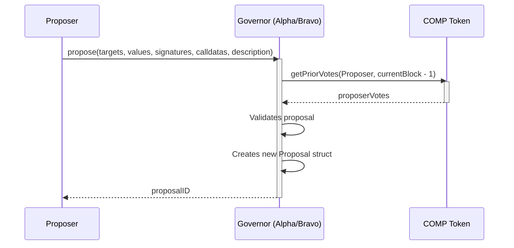
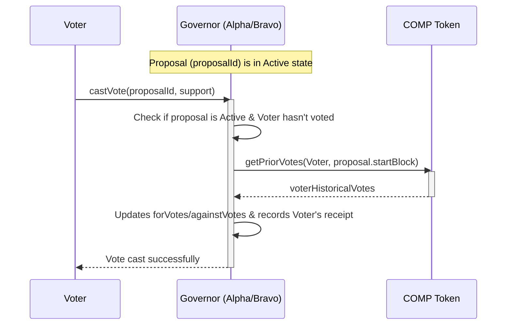
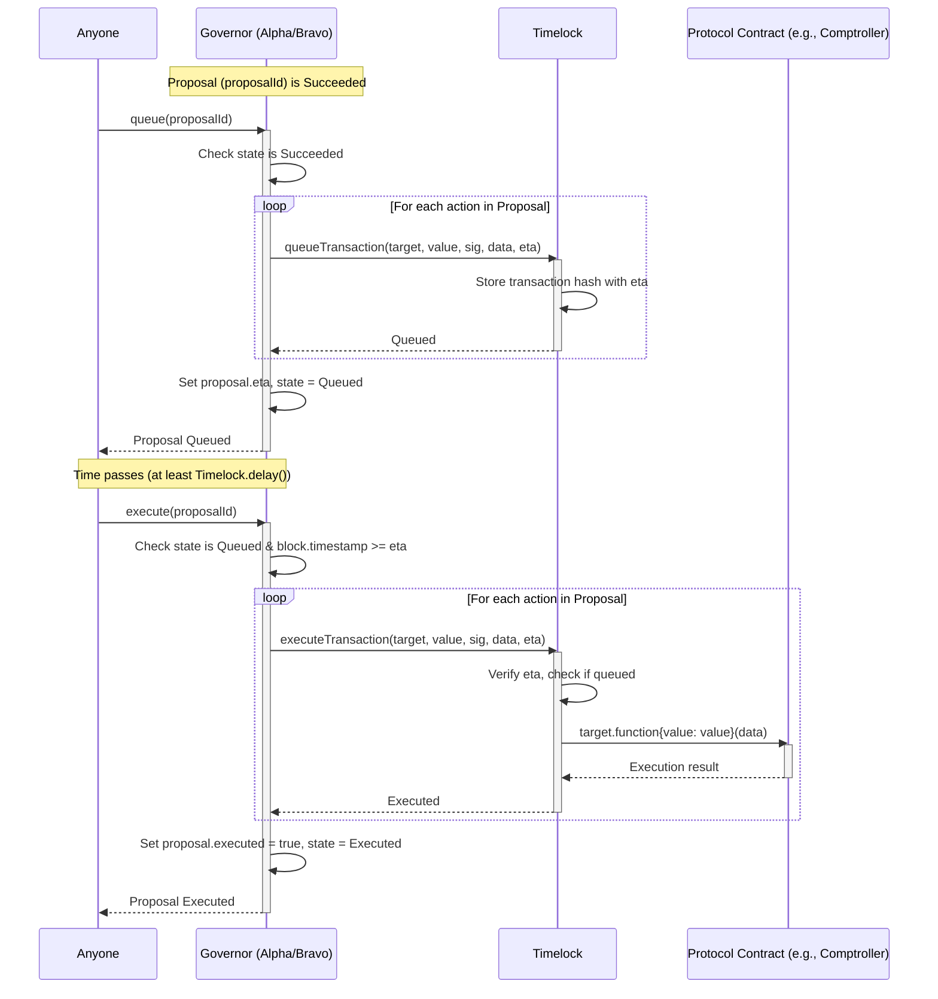

```markdown
# Compound Protocol: Deep Dive and Security Analysis

## 1. Architectural Overview

The Compound protocol is a decentralized, blockchain-based platform that enables users to lend and borrow cryptocurrencies. It creates money markets for various assets, allowing users to earn interest on supplied assets and borrow assets by providing collateral.

**Core Components:**

The protocol is comprised of several key smart contracts that work together:

1.  **CTokens (e.g., `CErc20.sol`, `CEther.sol`, `CToken.sol`):**
    *   **Purpose:** These are the primary building blocks of the Compound money markets. Each supported ERC-20 token or Ether has a corresponding CToken contract.
    *   **Functionality:**
        *   When users supply an underlying asset (e.g., DAI, ETH) to the protocol, they receive a corresponding amount of CToken (e.g., cDAI, cETH) in return. These CTokens represent the user's supplied balance and accrue interest over time.
        *   CTokens are themselves ERC-20 compliant, meaning they can be transferred, traded, or used in other DeFi protocols.
        *   The exchange rate between a CToken and its underlying asset increases as interest accrues in the market, meaning CTokens become more valuable relative to the underlying asset over time.
        *   Users can redeem their CTokens to withdraw their supplied underlying assets plus accrued interest.
        *   CTokens also handle the logic for borrowing, repaying borrows, and liquidations for their specific market.

2.  **Comptroller (`Comptroller.sol`):**
    *   **Purpose:** This is the risk management and logic hub of the Compound protocol. It determines how much collateral a user must maintain, whether they can borrow or withdraw assets, and handles liquidation conditions.
    *   **Functionality:**
        *   **Collateral Management:** Users must "enter markets" via the Comptroller to use their supplied assets (represented by CTokens) as collateral. The Comptroller tracks which assets a user has enabled as collateral.
        *   **Borrowing Limits:** It calculates a user's borrowing capacity based on the value of their collateral and the "collateral factor" for each asset. The collateral factor is a risk parameter (e.g., 0.75) that determines the portion of collateral value that can be borrowed against.
        *   **Liquidation Logic:** If a user's borrow balance exceeds their borrowing capacity (i.e., their account becomes undercollateralized), the Comptroller allows other users (liquidators) to repay a portion of the outstanding borrow in exchange for a discounted portion of the borrower's collateral.
        *   **Market Listing:** The admin (initially a multisig, later Compound Governance) can list new CToken markets through the Comptroller.
        *   **Pause Guardian:** Provides functionality to pause certain actions (mint, borrow, transfer, seize) in emergencies.
        *   **COMP Distribution:** Manages the distribution of COMP tokens to suppliers and borrowers in eligible markets.

3.  **Price Oracle (`PriceOracle.sol`, `SimplePriceOracle.sol`):**
    *   **Purpose:** Provides the protocol with the current market prices of the underlying assets. Accurate price feeds are crucial for calculating collateral value, borrowing capacity, and liquidation thresholds.
    *   **Functionality:**
        *   The `PriceOracle` is an interface, and the actual price feeds are provided by a concrete implementation (e.g., `SimplePriceOracle` for initial setup, or more robust oracles like Chainlink or Uniswap TWAP oracles in production).
        *   The Comptroller queries the Price Oracle to get the USD value (or ETH value, depending on the oracle's denomination) of the assets supplied as collateral and the assets being borrowed.

4.  **Interest Rate Model (`InterestRateModel.sol`, `JumpRateModel.sol`, `WhitePaperInterestRateModel.sol` etc.):**
    *   **Purpose:** Dynamically determines the borrowing and supply interest rates for each CToken market based on supply and demand.
    *   **Functionality:**
        *   Each CToken market is associated with an Interest Rate Model contract.
        *   Interest rates typically increase as the utilization of a market (percentage of supplied assets that are borrowed) increases. This incentivizes supply when demand is high and disincentivizes borrowing.
        *   Different models (e.g., `JumpRateModel`) can have different interest rate curves, often with a "kink" where the rate increases more sharply after a certain utilization threshold.
        *   The supply rate paid to lenders is derived from the borrow rate, minus a portion set aside as reserves (defined by the `reserveFactorMantissa` in the CToken contract).

5.  **Governance (COMP Token, GovernorAlpha/Bravo, Timelock):**
    *   **`Comp.sol` (COMP Token):**
        *   **Purpose:** The native governance token of the Compound protocol.
        *   **Functionality:** COMP token holders can vote on proposals to change protocol parameters, add new markets, upgrade contracts, and control the treasury. COMP is distributed to users who supply or borrow assets in the protocol.
    *   **`GovernorAlpha.sol` / `GovernorBravo.sol` (Governance Module):**
        *   **Purpose:** The contract that manages the governance process.
        *   **Functionality:** Allows COMP holders to create proposals, delegate their voting power, vote on proposals, and execute successful proposals. Proposals typically involve calling functions on other protocol contracts (e.g., the Comptroller or a CToken) to enact changes.
    *   **`Timelock.sol`:**
        *   **Purpose:** Adds a mandatory time delay to the execution of governance proposals.
        *   **Functionality:** Once a governance proposal is successfully voted on, it must be queued in the Timelock contract for a predefined period (e.g., 2 days). Only after this delay can the proposal be executed. This provides users with time to react to upcoming changes, such as withdrawing funds if they disagree with a proposal. The Timelock contract is typically the `admin` of the Comptroller and other key contracts.

**Overall Functionality & Interactions Diagram:**

```mermaid
graph TD
    subgraph User
        U[User]
    end

    subgraph CompoundProtocol
        CT_ETH[cETH CToken]
        CT_DAI[cDAI CToken]
        CT_OTHER[cOther CToken]

        COMPTROLLER[Comptroller]
        ORACLE[Price Oracle]
        IRM_ETH[InterestRateModel for ETH]
        IRM_DAI[InterestRateModel for DAI]
        IRM_OTHER[InterestRateModel for Other]

        subgraph Governance
            COMP[COMP Token]
            GOVERNOR[GovernorAlpha/Bravo]
            TIMELOCK[Timelock]
        end
    end

    U -- Supplies/Borrows ETH --> CT_ETH
    U -- Supplies/Borrows DAI --> CT_DAI
    U -- Supplies/Borrows Other --> CT_OTHER

    CT_ETH -- Manages ETH Market --> COMPTROLLER
    CT_DAI -- Manages DAI Market --> COMPTROLLER
    CT_OTHER -- Manages Other Market --> COMPTROLLER

    COMPTROLLER -- Policy Checks (Mint, Redeem, Borrow, Liquidate) --> CT_ETH
    COMPTROLLER -- Policy Checks --> CT_DAI
    COMPTROLLER -- Policy Checks --> CT_OTHER

    COMPTROLLER -- Gets Asset Prices --> ORACLE
    COMPTROLLER -- Admin Functions (Set Collateral Factor, List Market) --> TIMELOCK

    CT_ETH -- Gets Borrow/Supply Rates --> IRM_ETH
    CT_DAI -- Gets Borrow/Supply Rates --> IRM_DAI
    CT_OTHER -- Gets Borrow/Supply Rates --> IRM_OTHER

    GOVERNOR -- Manages Proposals --> COMP
    GOVERNOR -- Executes via --> TIMELOCK
    TIMELOCK -- Admin of --> COMPTROLLER
    TIMELOCK -- Admin of --> CT_ETH
    TIMELOCK -- Admin of --> CT_DAI
    TIMELOCK -- Admin of --> CT_OTHER
    TIMELOCK -- Admin of --> IRM_ETH
    TIMELOCK -- Admin of --> IRM_DAI
    TIMELOCK -- Admin of --> IRM_OTHER

    U -- Holds/Votes --> COMP
    U -- Creates Proposals --> GOVERNOR

    classDef ctoken fill:#f9f,stroke:#333,stroke-width:2px;
    classDef core fill:#bbf,stroke:#333,stroke-width:2px;
    classDef governance fill:#9f9,stroke:#333,stroke-width:2px;
    classDef oracle fill:#ff9,stroke:#333,stroke-width:2px;

    class CT_ETH,CT_DAI,CT_OTHER ctoken;
    class COMPTROLLER,IRM_ETH,IRM_DAI,IRM_OTHER core;
    class GOVERNOR,TIMELOCK,COMP governance;
    class ORACLE oracle;
end
```

## 2. Smart Contract Breakdown

### 2.1. CToken Contracts (`CToken.sol`, `CErc20.sol`, `CEther.sol`)

*   **Purpose:** CTokens are the core of Compound's money markets. Each CToken (e.g., cDAI, cETH, cUSDC) represents a share of a lending pool for a specific underlying asset.
*   **Functionality:** ERC-20 compliant, interest accrual via increasing exchange rate, minting (supplying), redeeming (withdrawing), borrowing, repaying, liquidating, reserve management, and administrative functions.
*   **Interactions:** Comptroller (policy hooks), InterestRateModel (rate fetching), Underlying Asset (transfers), Users, Liquidators.
*   **Diagram (`CToken` - Generic Functionality):**
    ```mermaid
    graph TD
        subgraph UserActor
            U[User/Liquidator]
        end

        subgraph CTokenContract [CToken (e.g., cDAI)]
            direction LR
            State[State Variables <br> - totalSupply <br> - totalBorrows <br> - totalReserves <br> - borrowIndex <br> - exchangeRate (derived) <br> - accountTokens <br> - accountBorrows <br> - reserveFactorMantissa]

            subgraph Functions
                direction TB
                Mint[mint()]
                Redeem[redeem()/redeemUnderlying()]
                Borrow[borrow()]
                Repay[repayBorrow()]
                Liquidate[liquidateBorrow()]
                Seize[seize()]
                AccrueInterest[accrueInterest()]
                AdminFuncs[_setInterestRateModel(), _setReserveFactor()]
            end

            AccrueInterest -- Updates --> State
            Mint -- Updates --> State
            Redeem -- Updates --> State
            Borrow -- Updates --> State
            Repay -- Updates --> State
            Liquidate -- Updates --> State
            Seize -- Updates --> State
            AdminFuncs -- Updates --> State
        end

        subgraph ExternalContracts
            COMPTROLLER_CT[Comptroller]
            IRM_CT[InterestRateModel]
            UNDERLYING_ASSET[Underlying ERC20/ETH]
            COLLATERAL_CTOKEN[Collateral CToken (for seize)]
        end

        U -- Calls --> Mint
        U -- Calls --> Redeem
        U -- Calls --> Borrow
        U -- Calls --> Repay
        U -- (Liquidator) Calls --> Liquidate

        Mint -- Transfers In --> UNDERLYING_ASSET
        Mint -- Checks Policy --> COMPTROLLER_CT

        Redeem -- Transfers Out --> UNDERLYING_ASSET
        Redeem -- Checks Policy --> COMPTROLLER_CT

        Borrow -- Transfers Out --> UNDERLYING_ASSET
        Borrow -- Checks Policy --> COMPTROLLER_CT

        Repay -- Transfers In --> UNDERLYING_ASSET
        Repay -- Checks Policy --> COMPTROLLER_CT

        Liquidate -- Calls repayBorrowFresh (internally) --> Repay
        Liquidate -- Checks Policy --> COMPTROLLER_CT
        Liquidate -- Calculates Seize Amount via --> COMPTROLLER_CT
        Liquidate -- Calls seize() on --> COLLATERAL_CTOKEN

        Seize -- Called by Borrowed CToken during liquidation --> CTokenContract
        Seize -- Checks Policy --> COMPTROLLER_CT
        Seize -- Transfers Collateral from Borrower to Liquidator --> State

        AccrueInterest -- Gets Borrow Rate --> IRM_CT

        AdminFuncs -- Callable by Admin (Timelock) --> CTokenContract

        classDef ctoken fill:#f9f,stroke:#333,stroke-width:2px;
        classDef core fill:#bbf,stroke:#333,stroke-width:2px;
        classDef ext fill:#lightgrey,stroke:#333,stroke-width:2px;

        class CTokenContract ctoken;
        class COMPTROLLER_CT,IRM_CT core;
        class UNDERLYING_ASSET,COLLATERAL_CTOKEN ext;
    ```

### 2.2. Comptroller Contract (`Comptroller.sol`)

*   **Purpose:** Central risk management and policy enforcement. Governs collateral, borrow limits, liquidations, market listings, and COMP distribution.
*   **Functionality:** Market management (listing, enter/exit), collateral/liquidity calculations, policy hooks for CTokens, liquidation parameter management, price oracle interface, pause functionality, COMP distribution, borrow caps.
*   **Interactions:** CTokens (calls hooks, gets balances), PriceOracle (gets prices), Timelock/Admin (admin functions), Users (enter/exit market, claim COMP), Unitroller (proxy).
*   **Diagram (`Comptroller` - Core Logic & Hooks):**
    ```mermaid
    graph TD
        subgraph Actors_Comptroller
            User_C[User]
            CTK_C[CToken Contract]
            ADM_C[Admin/Timelock]
            PG_C[Pause Guardian]
        end

        subgraph ComptrollerContract_C [Comptroller]
            direction LR

            subgraph StateAndStorage_C
                MarketsDB_C["markets (isListed, collateralFactor, etc.)"]
                AccountAssetsDB_C["accountAssets (user's entered markets)"]
                LiquidityParams_C["closeFactor, liquidationIncentive"]
                PriceOracleAddr_C["oracle (address)"]
                PauseStates_C["mint/borrow/transfer/seize Paused"]
                CompDistroState_C["COMP Speeds, Indices, Accrued"]
                BorrowCapsDB_C["borrowCaps"]
            end

            subgraph PolicyHooks_C
                direction TB
                MintAllowed_C["mintAllowed()"]
                RedeemAllowed_C["redeemAllowed()"]
                BorrowAllowed_C["borrowAllowed()"]
                LiquidateBorrowAllowed_C["liquidateBorrowAllowed()"]
                SeizeAllowed_C["seizeAllowed()"]
                TransferAllowed_C["transferAllowed()"]
            end

            subgraph LiquidityFunctions_C
                direction TB
                GetAccountLiquidity_C["getAccountLiquidity()"]
                GetHypoLiquidity_C["getHypotheticalAccountLiquidity()"]
                LiquidateCalcSeize_C["liquidateCalculateSeizeTokens()"]
            end

            subgraph MarketManagementFuncs_C
                direction TB
                EnterMarkets_C["enterMarkets()"]
                ExitMarket_C["exitMarket()"]
                SupportMarket_C["_supportMarket() (Admin)"]
                SetCollFactor_C["_setCollateralFactor() (Admin)"]
            end

            subgraph OracleAndPauseFuncs_C
                direction TB
                SetPriceOracle_C["_setPriceOracle() (Admin)"]
                SetPauseState_C["_setMintPaused(), etc. (Admin/PauseGuardian)"]
            end

            subgraph CompDistributionFuncs_C
                direction TB
                ClaimComp_C["claimComp()"]
                UpdateCompIndices_C["updateCompSupply/BorrowIndex()"]
                DistributeComp_C["distributeSupplier/BorrowerComp()"]
                SetCompSpeeds_C["_setCompSpeeds() (Admin)"]
            end

            PolicyHooks_C -- Reads/Uses --> MarketsDB_C
            PolicyHooks_C -- Reads/Uses --> AccountAssetsDB_C
            PolicyHooks_C -- Calls --> GetHypoLiquidity_C
            PolicyHooks_C -- Reads --> PauseStates_C
            PolicyHooks_C -- Calls --> UpdateCompIndices_C
            PolicyHooks_C -- Calls --> DistributeComp_C
            BorrowAllowed_C -- Reads --> BorrowCapsDB_C

            GetAccountLiquidity_C -- Reads --> MarketsDB_C
            GetAccountLiquidity_C -- Reads --> AccountAssetsDB_C
            GetAccountLiquidity_C -- Calls CToken.getAccountSnapshot --> CTK_C
            GetAccountLiquidity_C -- Gets Price --> PO_C[PriceOracle]

            LiquidateCalcSeize_C -- Gets Price --> PO_C
            LiquidateCalcSeize_C -- Reads --> LiquidityParams_C
            LiquidateCalcSeize_C -- Calls CToken.exchangeRateStored --> CTK_C

            MarketManagementFuncs_C -- Modifies --> MarketsDB_C
            MarketManagementFuncs_C -- Modifies --> AccountAssetsDB_C

            OracleAndPauseFuncs_C -- Modifies --> PriceOracleAddr_C
            OracleAndPauseFuncs_C -- Modifies --> PauseStates_C

            CompDistributionFuncs_C -- Modifies --> CompDistroState_C
            CompDistributionFuncs_C -- Reads --> MarketsDB_C
        end

        CTK_C -- Calls --> PolicyHooks_C
        CTK_C -- Calls --> LiquidateCalcSeize_C

        User_C -- Calls --> EnterMarkets_C
        User_C -- Calls --> ExitMarket_C
        User_C -- Calls --> ClaimComp_C

        ADM_C -- Calls --> SupportMarket_C
        ADM_C -- Calls --> SetCollFactor_C
        ADM_C -- Calls --> SetPriceOracle_C
        ADM_C -- Calls --> SetPauseState_C
        ADM_C -- Calls --> SetCompSpeeds_C
        ADM_C -- Sets Admin for --> ComptrollerContract_C

        PG_C -- Calls --> SetPauseState_C

        ComptrollerContract_C -- Gets Prices --> PO_C

        classDef comptroller fill:#bbf,stroke:#333,stroke-width:2px;
        classDef actor fill:#fff,stroke:#333,stroke-width:1px;
        classDef ext fill:#lightgrey,stroke:#333,stroke-width:2px;

        class ComptrollerContract_C comptroller;
        class User_C,CTK_C,ADM_C,PG_C actor;
        class PO_C ext;
    ```

### 2.3. Price Oracle (`PriceOracle.sol` and implementations)

*   **Purpose:** Provides asset prices relative to a common numeraire (ETH or USD) for collateral valuation, borrow capacity, and liquidation calculations.
*   **Functionality:** `getUnderlyingPrice(CToken cToken)` is the key interface function. Implementations like `SimplePriceOracle` allow manual price setting, while production oracles (e.g., Chainlink-based) fetch prices from external sources.
*   **Interactions:** Comptroller (primary consumer), Admin/Guardian (for simple oracles), External Data Sources (for production oracles).
*   **Diagram (`PriceOracle` Interface and `SimplePriceOracle` Example):**
    ```mermaid
    graph TD
        subgraph ProtocolActor_PO
            COMPTROLLER_PO[Comptroller]
        end

        subgraph OracleSystem_PO
            direction LR
            PRICE_ORACLE_INTERFACE_PO[PriceOracle (Interface) <br> - getUnderlyingPrice(CToken) returns uint <br> - isPriceOracle]

            subgraph SimplePriceOracleImpl_PO [SimplePriceOracle (Implementation)]
                direction TB
                Guardian_PO[Guardian/Admin]
                AssetPricesDB_PO["assetPrices[address => uint]"]
                GetPriceFunc_PO["getUnderlyingPrice(CToken cToken)"]
                SetPriceFunc_PO["setUnderlyingPrice(CToken, uint) <br> setDirectPrice(address, uint)"]

                GetPriceFunc_PO -- Reads --> AssetPricesDB_PO
                SetPriceFunc_PO -- Writes --> AssetPricesDB_PO
            end

            PRICE_ORACLE_INTERFACE_PO -. Implemented by .-> SimplePriceOracleImpl_PO
        end

        COMPTROLLER_PO -- Calls getUnderlyingPrice() --> PRICE_ORACLE_INTERFACE_PO

        Guardian_PO -- Calls --> SetPriceFunc_PO

        classDef oracle fill:#ff9,stroke:#333,stroke-width:2px;
        classDef interface fill:#e9e,stroke:#333,stroke-width:2px;
        classDef actor fill:#bbf,stroke:#333,stroke-width:2px;

        class PRICE_ORACLE_INTERFACE_PO interface;
        class SimplePriceOracleImpl_PO oracle;
        class COMPTROLLER_PO actor;
    ```

### 2.4. Interest Rate Model (`InterestRateModel.sol` and implementations)

*   **Purpose:** Dynamically determines borrow and supply interest rates for each CToken market, primarily based on market utilization.
*   **Functionality:** `getBorrowRate(cash, borrows, reserves)` and `getSupplyRate(...)` are key interface functions. Implementations like `WhitePaperInterestRateModel` (linear) or `JumpRateModel` (linear with a kink) define specific interest rate curves.
*   **Interactions:** CToken (calls `getBorrowRate`), Admin/Timelock (sets model for a market).
*   **Diagram (`InterestRateModel` Interface and `JumpRateModel` Example):**
    ```mermaid
    graph TD
        subgraph ProtocolActor_IRM
            CTOKEN_IRM[CToken Contract]
        end

        subgraph IRM_System_IRM
            direction LR
            IRM_INTERFACE_IRM[InterestRateModel (Interface) <br> - getBorrowRate(...) returns uint <br> - getSupplyRate(...) returns uint <br> - isInterestRateModel]

            subgraph JumpRateModelImpl_IRM [JumpRateModel (Implementation)]
                direction TB
                Admin_IRM[Admin/Timelock <br> (sets parameters at deployment)]

                RateParams_IRM["Rate Parameters <br> - baseRatePerBlock <br> - multiplierPerBlock <br> - kink <br> - jumpMultiplierPerBlock"]

                GetBorrowFunc_IRM["getBorrowRate(cash, borrows, reserves)"]
                GetSupplyFunc_IRM["getSupplyRate(cash, borrows, reserves, reserveFactor)"]

                GetBorrowFunc_IRM -- Reads --> RateParams_IRM
                GetSupplyFunc_IRM -- Reads --> RateParams_IRM
                GetSupplyFunc_IRM -- Uses --> GetBorrowFunc_IRM
            end

            IRM_INTERFACE_IRM -. Implemented by .-> JumpRateModelImpl_IRM
        end

        CTOKEN_IRM -- During accrueInterest(), calls --> GetBorrowFunc_IRM
        CTOKEN_IRM -- For display, may call --> GetSupplyFunc_IRM

        Admin_IRM -- Deploys & Configures --> JumpRateModelImpl_IRM

        classDef irm fill:#aaffaa,stroke:#333,stroke-width:2px;
        classDef interface fill:#e9e,stroke:#333,stroke-width:2px;
        classDef actor fill:#f9f,stroke:#333,stroke-width:2px;

        class IRM_INTERFACE_IRM interface;
        class JumpRateModelImpl_IRM irm;
        class CTOKEN_IRM actor;
    ```

### 2.5. Governance Contracts (`Comp.sol`, `GovernorAlpha.sol`/`Bravo`, `Timelock.sol`)

#### a. COMP Token (`Comp.sol`)
*   **Purpose:** ERC-20 token representing voting power and distributed as user incentives.
*   **Functionality:** Standard ERC-20, delegation of votes, historical vote weight checkpointing (`getPriorVotes`).
*   **Interactions:** Users (hold, transfer, delegate), Comptroller (distributes claimed COMP), Governor (reads vote weights).
*   **Diagram (`Comp.sol`):**
    ```mermaid
    graph TD
        subgraph UserActor_COMP
            U_COMP[User/COMP Holder]
        end

        subgraph CompTokenContract_COMP [Comp (ERC-20 & Governance Token)]
            direction LR
            subgraph ERC20State_COMP
                Name_COMP["name, symbol, decimals"]
                TotalSupply_COMP["totalSupply"]
                Balances_COMP["balances[address]"]
                Allowances_COMP["allowances[owner][spender]"]
            end

            subgraph GovernanceState_COMP
                Delegates_COMP["delegates[address delegator]"]
                Checkpoints_COMP["checkpoints[delegatee][index] <br> (fromBlock, votes)"]
                NumCheckpoints_COMP["numCheckpoints[delegatee]"]
            end

            subgraph Functions_COMP
                direction TB
                Transfer_COMP["transfer() / transferFrom()"]
                Approve_COMP["approve()"]
                Delegate_COMP["delegate(address delegatee)"]
                GetPriorVotes_COMP["getPriorVotes(account, blockNumber)"]
                InternalWriteCheckpoint_COMP["_writeCheckpoint()"]
                InternalMoveDelegates_COMP["_moveDelegates()"]
            end

            Transfer_COMP -- Calls --> InternalMoveDelegates_COMP
            Delegate_COMP -- Calls --> InternalMoveDelegates_COMP
            InternalMoveDelegates_COMP -- Calls --> InternalWriteCheckpoint_COMP
            InternalWriteCheckpoint_COMP -- Modifies --> Checkpoints_COMP
            InternalWriteCheckpoint_COMP -- Modifies --> NumCheckpoints_COMP
            GetPriorVotes_COMP -- Reads --> Checkpoints_COMP
        end

        subgraph ExternalContracts_COMP
            GOVERNOR_COMP[GovernorAlpha/Bravo]
            COMPTROLLER_COMP[Comptroller]
        end

        U_COMP -- Calls --> Transfer_COMP
        U_COMP -- Calls --> Approve_COMP
        U_COMP -- Calls --> Delegate_COMP

        GOVERNOR_COMP -- Calls --> GetPriorVotes_COMP

        COMPTROLLER_COMP -- Distributes/Holds --> CompTokenContract_COMP
        U_COMP -- Claims COMP from --> COMPTROLLER_COMP

        classDef comp fill:#9cf,stroke:#333,stroke-width:2px;
        classDef actor fill:#fff,stroke:#333,stroke-width:1px;
        classDef ext fill:#lightgrey,stroke:#333,stroke-width:2px;

        class CompTokenContract_COMP comp;
        class U_COMP actor;
        class GOVERNOR_COMP,COMPTROLLER_COMP ext;
    ```

#### b. GovernorAlpha (`GovernorAlpha.sol`) / GovernorBravo (`GovernorBravoDelegate.sol`)
*   **Purpose:** Manages the governance proposal lifecycle (creation, voting, queueing, execution).
*   **Functionality:** Proposal creation (`propose`), voting (`castVote`), state tracking, queueing (`queue` to Timelock), execution (`execute` via Timelock), cancellation. Bravo adds features like vote reasons and updatable parameters.
*   **Interactions:** COMP Token (vote weights), Timelock (queue/execute/cancel transactions), Users/Proposers/Voters, Guardian.
*   **Diagram (`GovernorAlpha` - Simplified Lifecycle):**
    ```mermaid
    graph TD
        subgraph Actors_GOV
            Proposer_GOV[Proposer (COMP Holder)]
            Voter_GOV[Voter (COMP Holder/Delegate)]
            GuardianAddr_GOV[Guardian]
            Anyone_GOV[Anyone]
        end

        subgraph GovernorContract_GOV [GovernorAlpha/Bravo]
            direction TB
            StateDB_GOV["proposals[id] -> ProposalData <br> (targets, values, signatures, calldatas, <br> startBlock, endBlock, forVotes, againstVotes, eta, etc.)"]

            ProposeFunc_GOV["propose()"]
            CastVoteFunc_GOV["castVote() / castVoteBySig()"]
            QueueFunc_GOV["queue()"]
            ExecuteFunc_GOV["execute()"]
            CancelFunc_GOV["cancel()"]
            StateFunc_GOV["state()"]

            ProposeFunc_GOV -- Writes --> StateDB_GOV
            CastVoteFunc_GOV -- Modifies --> StateDB_GOV
            QueueFunc_GOV -- Modifies --> StateDB_GOV
            ExecuteFunc_GOV -- Modifies --> StateDB_GOV
            CancelFunc_GOV -- Modifies --> StateDB_GOV
            StateFunc_GOV -- Reads --> StateDB_GOV
        end

        subgraph ExternalContracts_Gov_Ext
            COMP_TOKEN_GOV[Comp Token]
            TIMELOCK_CONTRACT_GOV[Timelock]
        end

        Proposer_GOV -- Calls --> ProposeFunc_GOV
        ProposeFunc_GOV -- Checks Proposer COMP --> COMP_TOKEN_GOV

        Voter_GOV -- Calls --> CastVoteFunc_GOV
        CastVoteFunc_GOV -- Checks Voter COMP @ startBlock --> COMP_TOKEN_GOV

        Anyone_GOV -- Calls --> StateFunc_GOV

        Anyone_GOV -- If Succeeded, Calls --> QueueFunc_GOV
        QueueFunc_GOV -- Calls queueTransaction() --> TIMELOCK_CONTRACT_GOV

        Anyone_GOV -- If Queued & Eta Reached, Calls --> ExecuteFunc_GOV
        ExecuteFunc_GOV -- Calls executeTransaction() --> TIMELOCK_CONTRACT_GOV

        GuardianAddr_GOV -- Calls --> CancelFunc_GOV
        Proposer_GOV -- (If votes drop) Can Call --> CancelFunc_GOV
        CancelFunc_GOV -- Calls cancelTransaction() --> TIMELOCK_CONTRACT_GOV

        GovernorContract_GOV -- Admin/Owner of --> TIMELOCK_CONTRACT_GOV

        classDef governor fill:#9f9,stroke:#333,stroke-width:2px;
        classDef actor fill:#fff,stroke:#333,stroke-width:1px;
        classDef ext fill:#lightgrey,stroke:#333,stroke-width:2px;

        class GovernorContract_GOV governor;
        class Proposer_GOV,Voter_GOV,GuardianAddr_GOV,Anyone_GOV actor;
        class COMP_TOKEN_GOV,TIMELOCK_CONTRACT_GOV ext;
    ```

#### c. Timelock (`Timelock.sol`)
*   **Purpose:** Introduces a mandatory delay for governance proposal execution. Acts as admin for critical protocol contracts.
*   **Functionality:** Admin control, delay mechanism (`delay`, `GRACE_PERIOD`), transaction queueing (`queueTransaction`), execution (`executeTransaction`), cancellation (`cancelTransaction`).
*   **Interactions:** Governor (admin, calls queue/execute/cancel), Protocol Contracts (Timelock is their admin).
*   **Diagram (`Timelock.sol`):**
    ```mermaid
    graph TD
        subgraph Actor_Timelock_TL
            GOVERNOR_CONTRACT_TL[GovernorAlpha/Bravo (as Admin)]
            Anyone_Exec_TL[Anyone (can call execute if conditions met)]
        end

        subgraph TimelockContract_TL [Timelock]
            direction TB
            State_Timelock_TL["admin, pendingAdmin <br> delay, GRACE_PERIOD <br> queuedTransactions[bytes32 hash] -> bool"]

            QueueFunc_TL["queueTransaction(target, value, signature, data, eta)"]
            ExecuteFunc_TL["executeTransaction(target, value, signature, data, eta)"]
            CancelFunc_TL["cancelTransaction(target, value, signature, data, eta)"]
            AdminFuncs_TL["setDelay(), setPendingAdmin(), acceptAdmin()"]

            QueueFunc_TL -- Modifies --> State_Timelock_TL
            ExecuteFunc_TL -- Modifies State_Timelock_TL, Performs Call --> TargetContract_TL[Protocol Contract <br> e.g., Comptroller]
            CancelFunc_TL -- Modifies --> State_Timelock_TL
            AdminFuncs_TL -- Modifies --> State_Timelock_TL
        end

        GOVERNOR_CONTRACT_TL -- Calls --> QueueFunc_TL
        GOVERNOR_CONTRACT_TL -- Calls --> CancelFunc_TL
        GOVERNOR_CONTRACT_TL -- Calls --> AdminFuncs_TL
        Anyone_Exec_TL -- Calls --> ExecuteFunc_TL

        classDef timelock fill:#f90,stroke:#333,stroke-width:2px;
        classDef actor fill:#fff,stroke:#333,stroke-width:1px;
        classDef target fill:#ccf,stroke:#333,stroke-width:1px;

        class TimelockContract_TL timelock;
        class GOVERNOR_CONTRACT_TL,Anyone_Exec_TL actor;
        class TargetContract_TL target;
    ```

## 3. User Flow Analysis

### 3.1. Supplying Assets
A user supplies an underlying asset (e.g., DAI) to a CToken market (e.g., cDAI) to earn interest and receives CTokens.
**Diagram (Supplying DAI to cDAI Market):**
```mermaid
sequenceDiagram
    participant U as User
    participant DAI as DAI (ERC20)
    participant cDAI as cDAI (CToken)
    participant CMPT as Comptroller
    participant IRM as InterestRateModel (for cDAI)

    U->>DAI: approve(cDAI, amountToSupply)
    activate DAI
    DAI-->>U: Approval success
    deactivate DAI

    U->>cDAI: mint(amountToSupply)
    activate cDAI
    cDAI->>cDAI: accrueInterest()
        activate cDAI
        cDAI->>IRM: getBorrowRate(cash, borrows, reserves)
        activate IRM
        IRM-->>cDAI: currentBorrowRate
        deactivate IRM
        cDAI-->>cDAI: Updates borrowIndex, totalBorrows, etc.
        deactivate cDAI # accrueInterest self-call

    cDAI->>CMPT: mintAllowed(cDAI, User, amountToSupply)
    activate CMPT
    CMPT-->>cDAI: 0 (NO_ERROR)
    deactivate CMPT

    cDAI->>DAI: transferFrom(User, cDAI, amountToSupply)
    activate DAI
    DAI-->>cDAI: DAI transferred
    deactivate DAI

    cDAI->>cDAI: mintFresh() calculations (calculates cTokens based on exchangeRate)
    cDAI-->>U: cDAI tokens minted
    deactivate cDAI
```

### 3.2. Enabling Asset as Collateral
User enables their CTokens as collateral via the Comptroller to borrow against them.
**Diagram:**
```mermaid
sequenceDiagram
    participant U as User
    participant CMPT as Comptroller
    participant cDAI as cDAI (CToken)

    Note over U, cDAI: User has previously supplied DAI and received cDAI

    U->>CMPT: enterMarkets([cDAI_address])
    activate CMPT
    CMPT->>CMPT: addToMarketInternal(cDAI, User)
        activate CMPT
        CMPT-->>CMPT: Sets cDAI as collateral for User
        deactivate CMPT # addToMarketInternal
    CMPT-->>U: Success
    deactivate CMPT
```

### 3.3. Borrowing Assets
A user borrows an underlying asset (e.g., USDC) using their enabled collateral (e.g., cDAI).
**Diagram (Borrowing USDC using cDAI as Collateral):**
```mermaid
sequenceDiagram
    participant U as User
    participant cUSDC as cUSDC (CToken)
    participant USDC as USDC (ERC20)
    participant CMPT as Comptroller
    participant PO as PriceOracle
    participant IRM_USDC as IRM (for cUSDC)
    participant cDAI_Collateral as cDAI (User's Collateral CToken)

    Note over U, CMPT: User has previously supplied DAI, received cDAI, <br/> and called enterMarkets([cDAI_address])

    U->>cUSDC: borrow(amountToBorrow)
    activate cUSDC
    cUSDC->>cUSDC: accrueInterest()
        activate cUSDC
        cUSDC->>IRM_USDC: getBorrowRate(...)
        activate IRM_USDC
        IRM_USDC-->>cUSDC: currentBorrowRate
        deactivate IRM_USDC
        cUSDC-->>cUSDC: Updates its own market state
        deactivate cUSDC # accrueInterest

    cUSDC->>CMPT: borrowAllowed(cUSDC, User, amountToBorrow)
    activate CMPT
        CMPT->>PO: getUnderlyingPrice(cUSDC)
        activate PO
        PO-->>CMPT: priceOfUSDC
        deactivate PO

        CMPT->>PO: getUnderlyingPrice(cDAI_Collateral)
        activate PO
        PO-->>CMPT: priceOfDAI
        deactivate PO

        CMPT->>cDAI_Collateral: getAccountSnapshot(User)
        activate cDAI_Collateral
        cDAI_Collateral-->>CMPT: (cDAI_balance, cDAI_borrowBalance, cDAI_exchangeRate)
        deactivate cDAI_Collateral

        CMPT->>cUSDC: getAccountSnapshot(User)
        activate cUSDC
        cUSDC-->>CMPT: (cUSDC_balance, cUSDC_borrowBalance, cUSDC_exchangeRate)
        deactivate cUSDC

        CMPT->>CMPT: Calculates hypothetical liquidity
        CMPT->>CMPT: Updates COMP distribution indices (if applicable)
    CMPT-->>cUSDC: 0 (NO_ERROR)
    deactivate CMPT

    cUSDC->>USDC: transfer(User, amountToBorrow)
    activate USDC
    USDC-->>cUSDC: USDC transferred
    deactivate USDC

    cUSDC->>cUSDC: borrowFresh() updates User's borrow balance & totalBorrows
    cUSDC-->>U: Receives USDC
    deactivate cUSDC
```

### 3.4. Repaying Assets
User repays their borrowed underlying assets (e.g., USDC).
**Diagram (Repaying USDC Borrow):**
```mermaid
sequenceDiagram
    participant U as User
    participant USDC as USDC (ERC20)
    participant cUSDC as cUSDC (CToken)
    participant CMPT as Comptroller
    participant IRM_USDC as IRM (for cUSDC)

    Note over U, cUSDC: User has an outstanding USDC borrow from cUSDC

    U->>USDC: approve(cUSDC, amountToRepay)
    activate USDC
    USDC-->>U: Approval success
    deactivate USDC

    U->>cUSDC: repayBorrow(amountToRepay)
    activate cUSDC
    cUSDC->>cUSDC: accrueInterest()
        activate cUSDC
        cUSDC->>IRM_USDC: getBorrowRate(...)
        activate IRM_USDC
        IRM_USDC-->>cUSDC: currentBorrowRate
        deactivate IRM_USDC
        cUSDC-->>cUSDC: Updates its own market state & User's borrow balance
        deactivate cUSDC # accrueInterest

    cUSDC->>CMPT: repayBorrowAllowed(cUSDC, User, User, amountToRepay)
    activate CMPT
    CMPT->>CMPT: Updates COMP distribution indices (if applicable)
    CMPT-->>cUSDC: 0 (NO_ERROR)
    deactivate CMPT

    cUSDC->>USDC: transferFrom(User, cUSDC, actualRepayAmount)
    activate USDC
    USDC-->>cUSDC: USDC transferred for repayment
    deactivate USDC

    cUSDC->>cUSDC: repayBorrowFresh() updates User's borrow principal & totalBorrows
    cUSDC-->>U: Borrow repaid
    deactivate cUSDC
```

### 3.5. Withdrawing Assets (Redeeming CTokens)
User redeems CTokens (e.g., cDAI) to withdraw their supplied underlying assets (DAI) plus interest.
**Diagram (Withdrawing DAI by Redeeming cDAI):**
```mermaid
sequenceDiagram
    participant U as User
    participant cDAI as cDAI (CToken)
    participant DAI as DAI (ERC20)
    participant CMPT as Comptroller
    participant PO as PriceOracle
    participant IRM_DAI as IRM (for cDAI)
    participant OtherCollateral_cETH as cETH (Example)
    participant OtherBorrow_cUSDC as cUSDC (Example)

    Note over U, cDAI: User holds cDAI tokens

    U->>cDAI: redeem(cTokensToRedeem)
    activate cDAI
    cDAI->>cDAI: accrueInterest()
        activate cDAI
        cDAI->>IRM_DAI: getBorrowRate(...)
        activate IRM_DAI
        IRM_DAI-->>cDAI: currentBorrowRate
        deactivate IRM_DAI
        cDAI-->>cDAI: Updates its own market state
        deactivate cDAI # accrueInterest

    cDAI->>CMPT: redeemAllowed(cDAI, User, cTokensToRedeem)
    activate CMPT
        Note over CMPT: If cDAI is used as collateral by User, <br/> Comptroller performs a full liquidity check.
        CMPT->>PO: getUnderlyingPrice(cDAI)
        CMPT->>PO: getUnderlyingPrice(OtherCollateral_cETH)
        CMPT->>PO: getUnderlyingPrice(OtherBorrow_cUSDC)
        CMPT->>cDAI: getAccountSnapshot(User)
        CMPT->>OtherCollateral_cETH: getAccountSnapshot(User)
        CMPT->>OtherBorrow_cUSDC: getAccountSnapshot(User)
        CMPT->>CMPT: Calculates hypothetical liquidity.
        CMPT->>CMPT: Updates COMP distribution indices (if applicable)
    CMPT-->>cDAI: 0 (NO_ERROR)
    deactivate CMPT

    cDAI->>DAI: transfer(User, underlyingAmountToRedeem)
    activate DAI
    DAI-->>cDAI: DAI transferred to User
    deactivate DAI

    cDAI->>cDAI: redeemFresh() burns User's cDAI tokens, updates totalSupply
    cDAI-->>U: Receives DAI
    deactivate cDAI
```

### 3.6. Liquidating Assets
A liquidator repays a portion of an undercollateralized borrower's debt (e.g., USDC) and seizes their collateral (e.g., cDAI) at a discount.
**Diagram (Liquidating Borrower B's USDC Debt, Seizing cDAI Collateral):**
```mermaid
sequenceDiagram
    participant L as Liquidator
    participant B as Borrower
    participant USDC as USDC (Borrowed Asset)
    participant cUSDC as cUSDC (Borrowed CToken)
    participant DAI as DAI (Collateral Asset)
    participant cDAI as cDAI (Collateral CToken)
    participant CMPT as Comptroller
    participant PO as PriceOracle
    participant IRM_USDC as IRM (for cUSDC)
    participant IRM_DAI as IRM (for cDAI)

    Note over B, CMPT: Borrower B is undercollateralized

    L->>USDC: approve(cUSDC, amountToRepay)
    activate USDC
    USDC-->>L: Approval success
    deactivate USDC

    L->>cUSDC: liquidateBorrow(B_address, amountToRepay, cDAI_address)
    activate cUSDC

    cUSDC->>cUSDC: accrueInterest()
        activate cUSDC; cUSDC->>IRM_USDC: getBorrowRate(); IRM_USDC-->>cUSDC: rate; deactivate IRM_USDC; deactivate cUSDC
    cUSDC->>cDAI: accrueInterest()
        activate cDAI; cDAI->>IRM_DAI: getBorrowRate(); IRM_DAI-->>cDAI: rate; deactivate IRM_DAI; deactivate cDAI

    cUSDC->>CMPT: liquidateBorrowAllowed(cUSDC, cDAI, L, B, amountToRepay)
    activate CMPT
        CMPT->>CMPT: getAccountLiquidity(B)
        CMPT->>PO: getUnderlyingPrice(cUSDC)
        CMPT->>PO: getUnderlyingPrice(cDAI)
        CMPT->>cUSDC: getAccountSnapshot(B)
        CMPT->>cDAI: getAccountSnapshot(B)
    CMPT-->>cUSDC: 0 (NO_ERROR)
    deactivate CMPT

    cUSDC->>cUSDC: repayBorrowFresh(L, B, amountToRepay)
        activate cUSDC
        cUSDC->>USDC: transferFrom(L, cUSDC, actualRepayAmount)
        activate USDC; USDC-->>cUSDC: USDC transferred; deactivate USDC
        cUSDC-->>cUSDC: B's USDC debt reduced
        deactivate cUSDC # repayBorrowFresh

    cUSDC->>CMPT: liquidateCalculateSeizeTokens(cUSDC, cDAI, actualRepayAmount)
    activate CMPT
        CMPT->>PO: getUnderlyingPrice(cUSDC)
        CMPT->>PO: getUnderlyingPrice(cDAI)
        CMPT->>cDAI: exchangeRateStored()
        activate cDAI; cDAI-->>CMPT: cDAI_exchangeRate; deactivate cDAI
    CMPT-->>cUSDC: seizeTokens (amount of cDAI to seize)
    deactivate CMPT

    cUSDC->>cDAI: seize(L, B, seizeTokens)
    activate cDAI
        cDAI->>CMPT: seizeAllowed(cDAI, cUSDC, L, B, seizeTokens)
        activate CMPT
        CMPT->>CMPT: Updates COMP distribution (if applicable)
        CMPT-->>cDAI: 0 (NO_ERROR)
        deactivate CMPT

        cDAI->>cDAI: seizeInternal() transfers cDAI from B to L
    cDAI-->>cUSDC: Seize successful
    deactivate cDAI

    cUSDC-->>L: Liquidation successful
    deactivate cUSDC
```

### 3.7. Creating and Voting on Governance Proposals
COMP holders create, vote on, and execute proposals via Governor and Timelock contracts.
**Diagram (Proposal Creation):**

**Diagram (Voting):**

**Diagram (Queueing & Execution):**


## 4. Glossary of Terms

| Term                           | Definition                                                                                                                                                                                             |
| :----------------------------- | :----------------------------------------------------------------------------------------------------------------------------------------------------------------------------------------------------- |
| **CToken**                     | An ERC-20 token that represents a user's supplied balance in a Compound market (e.g., cDAI for DAI, cETH for ETH). CTokens accrue interest over time through an increasing exchange rate with their underlying asset. |
| **Underlying Asset**           | The actual cryptocurrency (e.g., DAI, ETH, USDC, WBTC) that backs a CToken market. Users supply and borrow underlying assets.                                                                            |
| **Comptroller**                | The central smart contract that manages risk and enforces protocol rules. It determines collateral requirements, borrowing limits, and liquidation conditions.                                            |
| **Interest Rate Model (IRM)**  | A smart contract associated with each CToken market that dynamically determines borrow and supply interest rates based on market utilization (supply vs. demand).                                       |
| **Price Oracle**               | A smart contract system that provides the protocol with current market prices for underlying assets. Essential for valuing collateral and debt.                                                        |
| **Exchange Rate (CToken)**     | The rate at which a CToken can be exchanged for its underlying asset. This rate increases as supply interest accrues in the market.                                                                    |
| **Borrow Index**               | A per-market index that tracks the cumulative interest accrued on borrows.                                                                                                                             |
| **Total Borrows**              | The total amount of an underlying asset currently borrowed from a specific CToken market, including accrued interest.                                                                                  |
| **Total Supply (CToken)**      | The total number of a specific CToken currently in circulation.                                                                                                                                        |
| **Total Reserves**             | The accumulated portion of borrower interest held by a CToken market as reserves.                                                                                                                      |
| **Reserve Factor**             | A percentage of the interest paid by borrowers that is allocated to the market's reserves.                                                                                                             |
| **Collateral**                 | Assets (represented by CTokens) that a user has supplied to the protocol and explicitly enabled via the Comptroller to back their borrows.                                                              |
| **Collateral Factor**          | A risk parameter for each CToken market (e.g., 0.75) that determines the maximum amount a user can borrow against the value of that collateral asset.                                                    |
| **Account Liquidity**          | A user's overall borrowing health. Calculated as `(Total Collateral Value * Collateral Factor) - Total Borrow Value`. Positive liquidity means ability to borrow more/withdraw. Negative (shortfall) means undercollateralized. |
| **Shortfall**                  | The amount by which an account is undercollateralized. An account with a shortfall is eligible for liquidation.                                                                                        |
| **Enter Market**               | Action via Comptroller to designate a supplied CToken asset as collateral.                                                                                                                             |
| **Exit Market**                | Action via Comptroller to remove a CToken asset from collateral set.                                                                                                                                   |
| **Mint (CToken)**              | Supplying an underlying asset to a CToken market and receiving CTokens.                                                                                                                                |
| **Redeem (CToken)**            | Returning CTokens to their market and receiving the underlying asset (plus interest).                                                                                                                  |
| **Borrow**                     | Taking out a loan of an underlying asset from a CToken market, secured by collateral.                                                                                                                  |
| **Repay Borrow**               | Returning borrowed underlying assets to the CToken market.                                                                                                                                             |
| **Liquidation**                | Process where a liquidator repays a portion of an undercollateralized borrower's debt in exchange for discounted collateral.                                                                           |
| **Liquidator**                 | User/bot performing liquidations to earn the liquidation incentive.                                                                                                                                    |
| **Close Factor**               | Maximum percentage of a borrower's debt that can be repaid in a single liquidation.                                                                                                                    |
| **Liquidation Incentive**      | Discount a liquidator receives on seized collateral.                                                                                                                                                   |
| **COMP**                       | ERC-20 governance token of Compound. Used for voting and distributed as rewards.                                                                                                                       |
| **Governor (Alpha/Bravo)**     | Smart contract(s) managing the governance process (proposals, voting, execution).                                                                                                                      |
| **Timelock**                   | Smart contract introducing a mandatory delay for governance proposal execution. Admin of key protocol contracts.                                                                                       |
| **Proposal (Governance)**      | Set of actions (smart contract calls) submitted by COMP holders for voting.                                                                                                                            |
| **Quorum (Governance)**        | Minimum "for" votes required for a proposal to be eligible to pass.                                                                                                                                    |
| **Voting Delay (Governance)**  | Period between proposal creation and start of voting.                                                                                                                                                  |
| **Voting Period (Governance)** | Duration for which COMP holders can vote on an active proposal.                                                                                                                                        |
| **ETA (Timelock)**             | "Estimated Time of Arrival." Timestamp when a queued Timelock transaction can be executed.                                                                                                               |
| **Delegate (Governance)**      | Assigning COMP voting power to another address.                                                                                                                                                        |
| **Mantissa**                   | Fixed-point number representation, typically scaled by 1e18.                                                                                                                                           |
| **Accrue Interest**            | CToken process updating market state (borrow index, reserves, exchange rate) by calculating interest.                                                                                                  |
| **Pause Guardian**             | Address authorized to pause critical protocol functions in emergencies.                                                                                                                                |
| **Borrow Cap**                 | Per-market limit on total borrowable amount of an underlying asset.                                                                                                                                    |
| **Borrow Cap Guardian**        | Address, besides admin/governance, that can set borrow caps.                                                                                                                                           |

```
